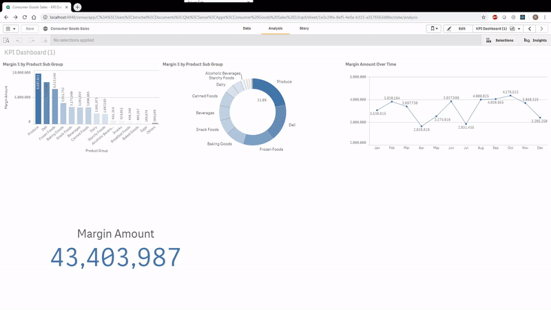

# QS BoomKPI

Boom KPI is a visualisation Extension based on p5.js and another project of mine [Firewords](https://github.com/borismichel/firewords) check out a demo here: [QS ROCKS!](https://firewords.herokuapp.com?QS%20ROCKS!)

I love p5.js and I love Qlik Sense, so expect more of this.

To try it yourself, download a pre-built version from the **build** folder. There's a zip file and the js/qext files to deploy.

## Pre-built version:

### To use on a Qlik Sense server:

1. Download the **qs-boomkpi.zip** file from the build folder
2. Import the **qs-boomkpi.zip** file on the Extensions tab of the QMC
3. Import the **Sniglet-ExtraBold.ttf** to the Default Content library of the QMC
4. Drag and drop the object like a standard KPI object
5. Blow some numbers up :)

### To use on Qlik Sense Desktop

1. Download the **qs-boomkpi.zip** file or both **qs-boomkpi.js** and **qs-boomkpi.qext** from the build folder
2. Extract/Copy **qs-boomkpi.js** and **qs-boomkpi.qext** to your **%userprofile%\documents\qlik\sense\extensions\qs-boomkpi**
3. Drag and drop the object like a standard KPI object
4. Blow some numbers up :)

## Pre-built version:

1. Clone or download the repo
2. Extract the repo and run ``npm install`` to install the dependencies
3. Everything you want is in the ``src`` folder
4. The p5 features are in ``component.js`` and ``lib/ptcl.js``

# Credit

[Thomas Gorr](https://twitter.com/thogorr) I took the basic frame for implementing p5 in extensions from his flappy data extension.